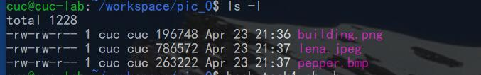
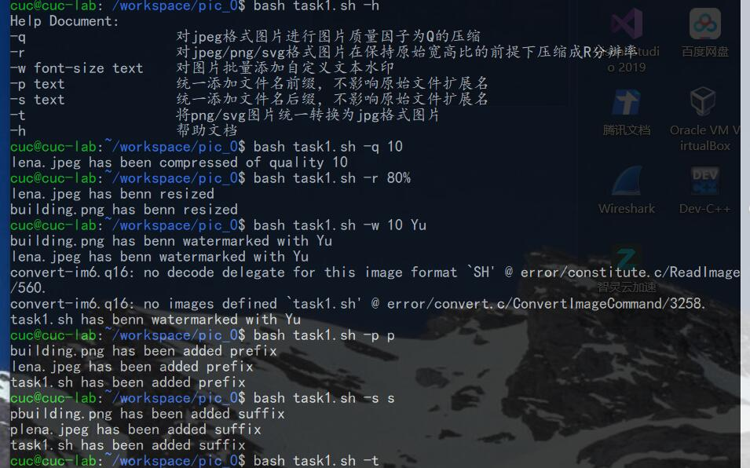
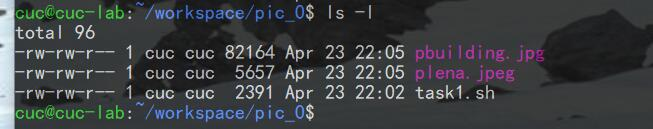
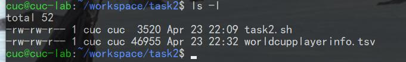
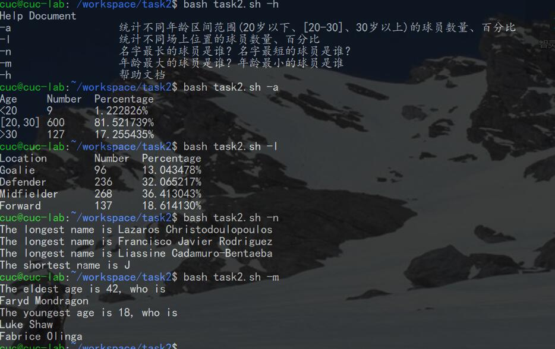
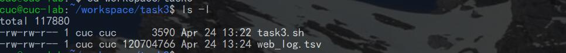
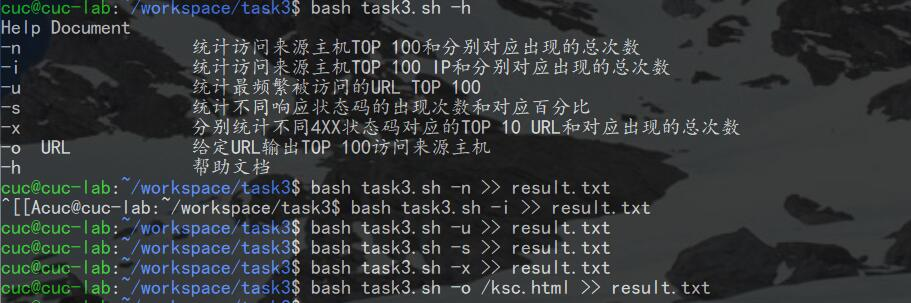
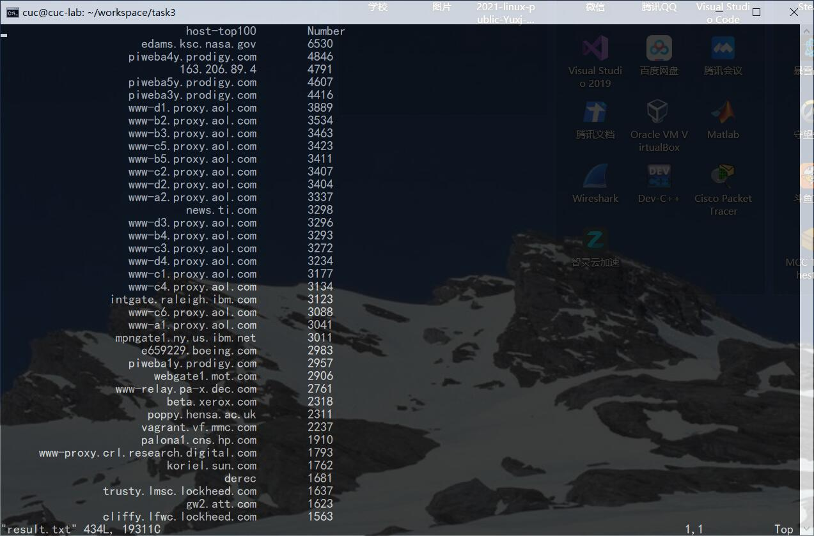

# SHELL脚本编程基础

### 任务一: 用bash编写一个图片批处理脚本，实现以下功能:

√  支持命令行参数方式使用不同功能

√  支持对指定目录下所有支持格式的图片文件进行批处理支持以下常见图片批处

√   支持以下文件批处理功能的单独使用或组合使用。支持对jpeg格式图片进行图片质量压缩

√   支持对jpeg/png/svg格式图片在保持原始宽高比的前提下压缩分辨率
 
√   支持对图片批量添加自定义文本水印

√   支持批量重命名(统一添加文件名前缀或后缀，不影响原始文件扩展名)

√   支持将png/svg图片统一转换为jpg格式图片

### 任务二： 用bash编写一个文本批处理脚本，对以下附件分别进行批量处理完成相应的数据统计任务：

√  统计不同年龄区间范围（20岁以下、[20-30]、30岁以上）的球员数量、百分比

√  统计不同场上位置的球员数量、百分比

√  名字最长的球员是谁？名字最短的球员是谁？

√  年龄最大的球员是谁？年龄最小的球员是谁？

### 任务三： 用bash编写一个文本批处理脚本，对以下附件分别进行批量处理完成相应的数据统计任务：

√  统计访问来源主机TOP 100和分别对应出现的总次数

√  统计访问来源主机TOP 100 IP和分别对应出现的总次数

√  统计最频繁被访问的URL TOP 100

√  统计不同响应状态码的出现次数和对应百分比

√  分别统计不同4XX状态码对应的TOP 10 URL和对应出现的总次数

√  给定URL输出TOP 100访问来源主机

## 实验过程：

### 任务一

传入图片

运行程序

结果

### 任务二

传入世界杯球员数据

运行程序、结果

### 任务三

传入日志数据

运行程序

结果

## 问题

imagemagick命令行下载不了，原因是asciinema和focal
版本有不兼容的问题，间接导致下载中出现错误，最后我移除了ppa，然后执行sudo apt install就好了，也不需要更换镜像源；

想要使用虚拟机系统处理主机文件，可以使用共享文件夹，也可以使用scp指令把主机文件发送到客机。

## 参考文献
shell文件代码借鉴参考邓曾虎同学的作业-https://github.com/CUCCS/2021-linux-public-David-cluns/tree/chap0x04