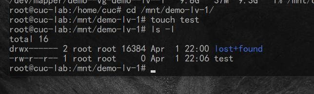
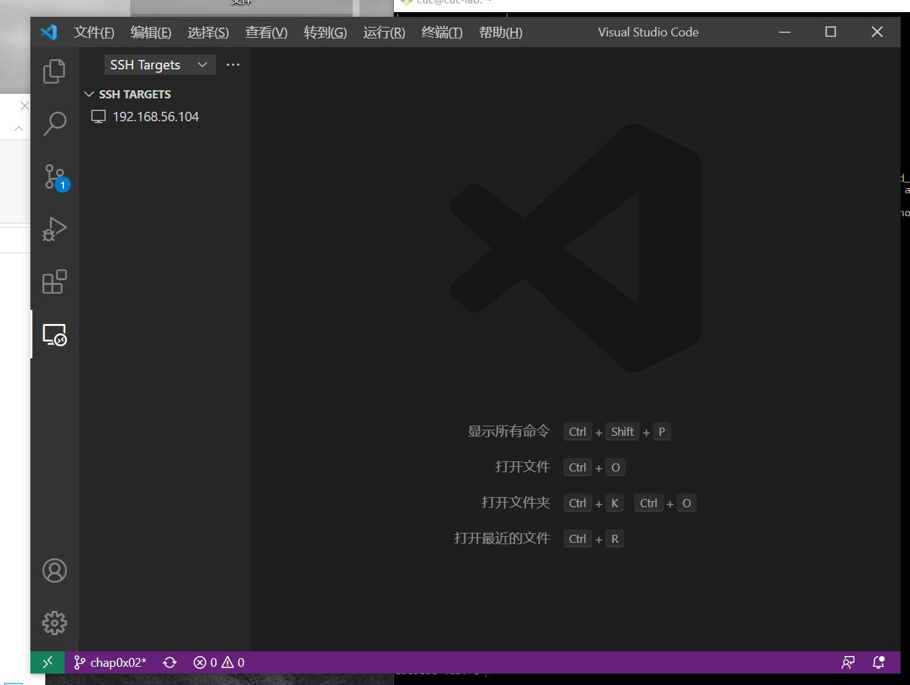

# Systemd

## 命令篇：

三、系统管理：

https://asciinema.org/a/P0nPDMWO4IcjQS4TEUb7sZWuX

四、Unit：

https://asciinema.org/a/FsvqPXNbUuY68vgHu57UuKLDQ

五、Unit的配置文件：

https://asciinema.org/a/ebndZupVOOP4rk6ZbMMFLSSmq

六、Target/七、日志管理：

https://asciinema.org/a/xsY8B5675qwnHFQFqHp87ZjM3

## 实战篇：

https://asciinema.org/a/uQ8r6FCt8UoDI41yEWfZdjdcV

# 自查清单
- 如何添加一个用户并使其具备sudo执行程序的权限？

1，sudo创建一个新用户test：

2，要使新用户具备sudo执行程序的权限，我们可以在/etc/sudoers文件中进行修改，先回到root：

3，vi /etc/sudors，对文件进行修改，在root用户信息下增加新用户信息：

4，ls -l检查：

- 如何将一个用户添加到一个用户组？

1，使用基本指令groupadd 和usermod来操作：

2，cat /etc/group查看组信息：

- 如何查看当前系统的分区表和文件系统详细信息？

使用lsblk命令查看，下图为我依照课件视频的操作，添加了两块sdb、sdc硬盘并加以分区后的结果：

- 如何实现开机自动挂载Virtualbox的共享目录分区？

1，VirtualBox里添加共享文件夹：

2，进入Linux终端，使用root用户操作，终端创建共享文件夹：

3，打开终端，安装增强功能：

4，mount -t vboxsf Linux /mnt/share，实现挂载：

5，在文件 /etc/rc.local 中追加mount -t vboxsf sharing /mnt/share命令:

6，mount可见完成了自动挂载：

- 基于LVM（逻辑分卷管理）的分区如何实现动态扩容和缩减容量？

1，先在sdb创建3个pv：

2，创建vg：

3，sdc创建pv，并加入demo-vg:

4，创建2个lv：

5，创建文件系统：

6，创建挂载点并挂载：

7，可以在分区创建测试文件test：

8，分区缩减：

9，分区扩容：

- 如何通过systemd设置实现在网络连通时运行一个指定脚本，在网络断开时运行另一个脚本？

1，修改systemd-network中的Service

2，ExecStartPost=网络联通时运行的指定脚本

3，ExecStopPost=网络断开时运行另一个脚本

- 如何通过systemd设置实现一个脚本在任何情况下被杀死之后会立即重新启动？实现杀不死？

1，sudo systemctl vi {scriptname}

2，Restart = always

3，sudo systemctl deamon-reload

# 遇到的问题

vscode中下载Remote Development，添加‘ssh cuc@192.168.56.104’:

尝试建立连接时出现错误：

查看日志发现错误，经过搜索，错误源于.ssh下的config文件权限出现问题：

通过魏迎迎同学的帮助，我找到了解决方案，对C盘用户目录下的.ssh文件夹的属性做更改，Everyone是罪魁祸首：

为了更改Everyone为我们计算机的用户，我们进行如下操作：找到”安全“，点击”高级“，点击”禁用继承“，选择第二项”从此对象中删除已继承的权限“：

.ssh的所有用户都被删除，我们对其添加所有者：点击“编辑”，点击“添加”，点击“高级”，点击“立即查找”，选择合适的用户名，点击确定或应用，以更改设置：

再次尝试建立连接，连接成功，错误解决：

查看ip地址是否符合，显示为：192.168.56.104，符合虚拟机地址：

-

su回到root的时候，卡住了：

查询后得知需要先sudo passwd root一次，再次su就可以了；

-

实现自动挂载时出现错误：

查询得知，Virtualbox增强功能为安装，但安装时会报错，但只要通过sudo apt install virtualbox-guest-utils就可以搞定，我之前自己找了很多安装方法都没成功，经过询问老师，很可能是出于版本的缘故。